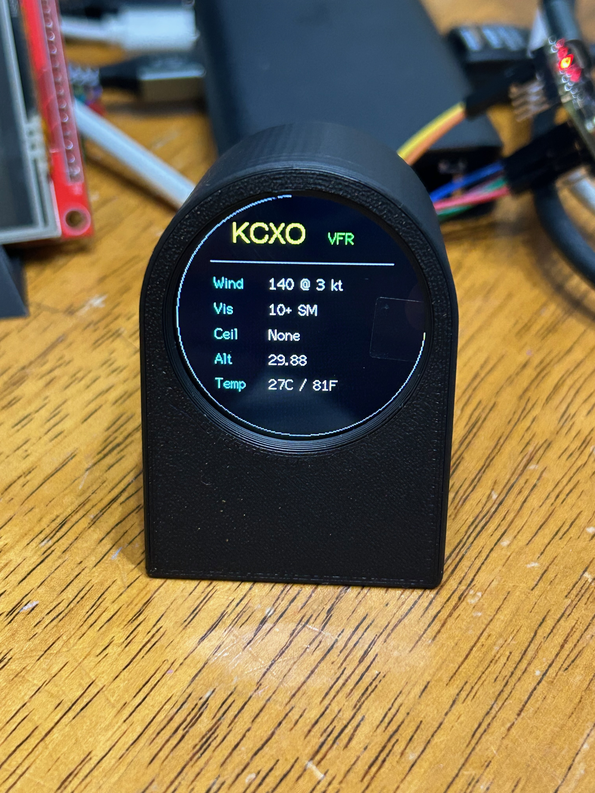

# Mini METAR Display



Mini METAR Display is an ESP32-C3 project that shows live aviation weather on a 1.28 inch round 240×240 TFT display.

It uses an ESP32-C3 Super Mini, a GC9A01 round TFT display, Wi-Fi setup through a captive portal, and live METAR data from AviationWeather.gov.

## Features

* ESP32-C3 Super Mini support
* 1.28 inch round 240×240 GC9A01 TFT display
* Wi-Fi setup portal using WiFiManager
* Airport ICAO code setup during Wi-Fi configuration
* Saved Wi-Fi and airport settings
* Live METAR data from AviationWeather.gov
* Automatic METAR refresh every 5 minutes
* BOOT-button Wi-Fi/config reset support
* Displays:

  * Airport code
  * Flight category
  * Wind
  * Visibility
  * Ceiling
  * Altimeter
  * Temperature in Celsius and Fahrenheit

## Hardware

### Main Components

* ESP32-C3 Super Mini development board
* 1.28 inch round TFT LCD display module
* 240×240 resolution
* GC9A01 display driver
* USB-C cable
* Jumper wires

## Display Wiring

| TFT Display Pin        | ESP32-C3 Super Mini Pin |
| ---------------------- | ----------------------- |
| `VCC` / `VIN`          | `3V3`                   |
| `GND`                  | `GND`                   |
| `SCL` / `SCK` / `CLK`  | `GPIO 4`                |
| `SDA` / `MOSI` / `DIN` | `GPIO 6`                |
| `CS`                   | `GPIO 7`                |
| `DC`                   | `GPIO 2`                |
| `RES` / `RST`          | `GPIO 3`                |


## Software Requirements

Install:

* Visual Studio Code
* PlatformIO IDE extension for Visual Studio Code
* Git

This project uses the Arduino framework through PlatformIO.

## PlatformIO Environment

The project uses the `esp32-c3-devkitm-1` board profile.

The ESP32-C3 Super Mini is not always listed directly in PlatformIO, so this compatible board profile is used.

```ini
[env:esp32-c3-supermini]
platform = espressif32
board = esp32-c3-devkitm-1
framework = arduino
monitor_speed = 115200
```

## Libraries

The project uses:

* `bodmer/TFT_eSPI`
* `bblanchon/ArduinoJson`
* `tzapu/WiFiManager`

`TFT_eSPI` drives the round TFT display.

`WiFiManager` creates the Wi-Fi setup portal and stores Wi-Fi credentials.

`ArduinoJson` parses the live METAR JSON response.

## Display Configuration

The GC9A01 display and SPI pins are configured in `platformio.ini` using build flags.

Current display pin mapping:

```ini
-D GC9A01_DRIVER=1
-D TFT_WIDTH=240
-D TFT_HEIGHT=240
-D TFT_MOSI=6
-D TFT_SCLK=4
-D TFT_CS=7
-D TFT_DC=2
-D TFT_RST=3
-D TFT_BL=-1
```

USB serial support for the ESP32-C3 is enabled with:

```ini
-D ARDUINO_USB_MODE=1
-D ARDUINO_USB_CDC_ON_BOOT=1
```

## Flashing the Prebuilt Firmware

The easiest way to install Mini METAR Display is to download the prebuilt firmware `.bin` file from GitHub Releases.

Go to:

[GitHub Releases](https://github.com/jasonmarquette/Mini-METAR-Display/releases)

Download the latest firmware file, for example:

```text
Mini-METAR-Display-ESP32-C3-SuperMini-v0.1.0.bin
```

Then flash it using Chrome or Edge:

1. Plug the ESP32-C3 Super Mini into your computer with USB.
2. Open:

```text
https://web.esphome.io/
```

3. Click **Connect**.
4. Select the ESP32-C3 serial port.
5. Click **Install**.
6. Choose **Pick a file**.
7. Select the downloaded `.bin` firmware file.
8. Wait for the flash process to complete.
9. Unplug the board.
10. Plug it back in normally.

After flashing, the board should boot into the Mini METAR Display firmware.

If no saved Wi-Fi settings exist, it will create the setup network:

```text
MiniMETAR-Setup
```

Connect to that network and open:

```text
http://192.168.4.1
```

## Build Instructions

These instructions are for developers who want to build the firmware from source.

Open the project folder in Visual Studio Code.

Then open a terminal inside VS Code and run:

```bash
pio run -e esp32-c3-supermini
```

A successful build should end with:

```text
SUCCESS
```

The compiled firmware will be created here:

```text
.pio/build/esp32-c3-supermini/firmware.bin
```

To prepare a firmware file for a GitHub release, copy and rename it:

```bash
mkdir -p release
cp .pio/build/esp32-c3-supermini/firmware.bin release/Mini-METAR-Display-ESP32-C3-SuperMini-v0.1.0.bin
```

Upload the renamed `.bin` file to the GitHub release.

## PlatformIO Upload Instructions

If you are developing the project locally, you can upload directly from PlatformIO instead of using the release `.bin`.

Plug the ESP32-C3 Super Mini into the computer with USB.

Run:

```bash
pio run -e esp32-c3-supermini --target upload
```

If upload fails, put the ESP32-C3 into boot/download mode:

1. Unplug USB.
2. Hold the `BOOT` button.
3. Plug USB back in.
4. Wait 2 seconds.
5. Release `BOOT`.
6. Run the upload command again.

After upload finishes, unplug the board and plug it back in normally.


## Wi-Fi Setup

This project does not hard-code the Wi-Fi SSID or password.

On first boot, the ESP32-C3 tries to connect using saved Wi-Fi settings. If no saved settings exist, or if it cannot connect, it creates a temporary Wi-Fi setup network:

```text
MiniMETAR-Setup
```

To configure Wi-Fi:

1. Power on the ESP32-C3.
2. Wait for the display to show the Wi-Fi setup screen.
3. On your phone or computer, connect to:

```text
MiniMETAR-Setup
```

4. A setup page may open automatically.
5. If it does not open automatically, go to:

```text
http://192.168.4.1
```

6. Select your home 2.4 GHz Wi-Fi network.
7. Enter the Wi-Fi password.
8. Enter the airport ICAO code, for example:

```text
KCXO
```

9. Save the configuration.

After Wi-Fi is saved, the ESP32-C3 should reconnect automatically on future boots.

## Airport Code Setup

The airport code is entered during Wi-Fi setup.

Examples:

```text
KCXO
KDWH
KIAH
KHOU
```

The airport code is saved in flash memory and reused on future boots.

The default airport code is currently:

```text
KCXO
```

The default value is configured in:

```text
src/wifi_helper.h
```

## Reset Wi-Fi and Airport Settings

The project supports resetting saved Wi-Fi and airport settings using the BOOT button while the firmware is running.

To reset configuration:

1. Power the ESP32-C3 normally.
2. Wait for it to boot.
3. Hold the `BOOT` button for about 5 seconds.
4. Watch the serial monitor for reset messages.
5. The board clears saved Wi-Fi and airport settings.
6. The board restarts.
7. The `MiniMETAR-Setup` Wi-Fi network should appear again.

Do not hold `BOOT` while plugging in the board for this reset feature. Holding `BOOT` during power-up usually puts the ESP32-C3 into upload/download mode instead of running the firmware.

## Live METAR Data

After Wi-Fi connects, the ESP32-C3 fetches live METAR data from AviationWeather.gov.

The API request format is:

```text
https://aviationweather.gov/api/data/metar?ids=KCXO&format=json
```

The airport code is replaced with the saved airport code from setup.

Example live METAR:

```text
METAR KCXO 210053Z 14003KT 10SM CLR 27/23 A2988
```

## Refresh Interval

The display fetches live METAR data:

* Once at startup after Wi-Fi connects
* Then every 5 minutes

The refresh interval is controlled in `src/main.cpp`:

```cpp
const unsigned long METAR_REFRESH_MS = 5UL * 60UL * 1000UL;
```

This equals:

```text
300,000 milliseconds = 5 minutes
```

## Displayed Weather Fields

The current display shows:

* Airport code
* Flight category, such as `VFR`, `MVFR`, `IFR`, or `LIFR`
* Wind
* Visibility
* Ceiling
* Altimeter
* Temperature in Celsius and Fahrenheit

Example display:

```text
KCXO    VFR

Wind 140 @ 3 kt
Vis  10+ SM
Ceil None
Alt  29.88
Temp 27C / 81F
```

## Project Structure

```text
Mini-METAR-Display/
├── LICENSE
├── README.md
├── platformio.ini
└── src/
    ├── display_helper.h
    ├── main.cpp
    ├── metar_client.h
    └── wifi_helper.h
```

## Source Files

### `src/main.cpp`

Controls the main program flow:

1. Starts serial output.
2. Initializes the display.
3. Connects to Wi-Fi.
4. Shows the saved airport code.
5. Fetches live METAR data.
6. Refreshes METAR data every 5 minutes.
7. Handles BOOT-button Wi-Fi reset.

### `src/display_helper.h`

Contains the TFT display drawing functions.

This file controls the startup screen, Wi-Fi screens, error screens, and METAR display screen.

### `src/wifi_helper.h`

Handles Wi-Fi setup using WiFiManager.

It also stores and retrieves the airport ICAO code.

### `src/metar_client.h`

Handles live METAR fetching and parsing.

It builds the AviationWeather.gov API URL, fetches JSON, parses the response, and formats display-ready fields.

## Troubleshooting

### Display is black

Check:

* `VCC` is connected to `3V3`
* `GND` is connected to `GND`
* `BL`, `LED`, or `BLK` is connected to `3V3`
* SPI pins match the wiring table
* Firmware uploaded successfully

### Display shows garbage

Try lowering SPI speed in `platformio.ini`.

Change:

```ini
-D SPI_FREQUENCY=40000000
```

to:

```ini
-D SPI_FREQUENCY=27000000
```

Then rebuild and upload.

### Colors look wrong

Some GC9A01 displays use a different color order.

Add this build flag in `platformio.ini`:

```ini
-D TFT_RGB_ORDER=TFT_BGR
```

Then rebuild and upload.

### Display is rotated wrong

In `src/display_helper.h`, find the display rotation setting:

```cpp
tft->setRotation(0);
```

Try values `1`, `2`, or `3`, then rebuild and upload.

### Wi-Fi setup page does not open

Connect to:

```text
MiniMETAR-Setup
```

Then manually open:

```text
http://192.168.4.1
```

### Board connects to Wi-Fi but METAR fails

Open the serial monitor and look for:

```text
Fetching METAR:
METAR HTTP code:
METAR payload:
```

If the HTTP code is not `200`, the request failed.

Check:

* The board is connected to Wi-Fi
* The airport code is valid
* The network has internet access
* The airport has recent METAR data available

### Serial monitor disconnects and reconnects

This can happen when the ESP32-C3 resets:

```text
Disconnected
Reconnecting
Connected
```

This is usually normal.

Use upload and monitor as separate steps:

```bash
pio run -e esp32-c3-supermini --target upload
pio device monitor --port /dev/cu.usbmodem12301 --baud 115200
```

Avoid using the combined `Upload and Monitor` task if it causes serial issues.

## Git Commands

Check status:

```bash
git status
```

Add changes:

```bash
git add .
```

Commit:

```bash
git commit -m "Update README for live METAR display"
```

Push:

```bash
git push
```

## Roadmap

### Version 0.1.0

* ESP32-C3 project setup
* Round TFT display test
* Wi-Fi setup portal

### Version 0.2.0

* Airport ICAO code setup
* Saved airport configuration

### Version 0.3.0

* Live METAR fetching
* METAR display screen
* 5-minute refresh interval

### Version 0.4.0

* Improved display layout
* Better error messages
* Wi-Fi reset/configuration improvements

### Version 0.5.0

* Optional radar weather summary
* 3D printed enclosure

## License

This project is licensed under the MIT License. See the [LICENSE](LICENSE) file for details.

